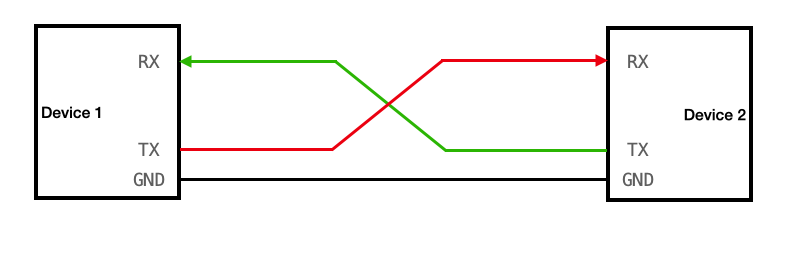

# Solar Embedded Firmware Starter Project

The goal of this project is to teach you to write a bit of embedded firmware to output some text to your serial console. 

First, follow these [installation instructions](https://lhr-solar.github.io/Embedded-Sharepoint/Installation/) to get your environment set up for embedded development. Make sure you clone the Embedded-Sharepoint.

A few prerequisites:

## Questions

### What's an embedded?

An embedded system just refers to a circuit board with a microcontroller made for a specific purpose.

### What's a firmware?

Firmware refers to code that is run at a low level.

### What's a C?

C is the language we use to write code for most low-level systems. Here's a few tutorials that you may find interest in working through on your own time!

- [Beej's Guide to C Programming](https://beej.us/guide/bgc/html/split/)
- [Cprogramming.com](https://www.cprogramming.com/tutorial/c-tutorial.html)
- [C Programming: A Modern Approach](http://knking.com/books/c2/index.html)

If you're coming from a different programming language, the sorts of things you may not be used to include pointers and structures, so you may just want to look at those sections. These are mainly provided if you're someone who learns by reading textbooks, but I've never really been that way, so you could just jump in and learn on-the-go.

### What's a GDB?

GDB is the GNU debugger, and is a tool to step through, pause, and print expression values from your code. Whether it's running on your computer or running on a board, there's a way to run GDB.

Note that it is HIGHLY INTRUSIVE, which really just means that it can screw up any timing-related functionalities.

### What's a Linux? What's a shell?

Linux is the operating system we typically use to code for our embedded systems. It comes with an interface called a shell, which is also known as the command prompt or the terminal. Once you know how to use it, it's a powerful tool.

After installation, try messing around in your Linux shell. Here's a [basic list of commands](https://www.w3schools.com/bash/bash_commands.php). We'll be using this to compile and flash code.

If someone tells you to run `rm -rf *` to delete the French language pack, do NOT do so. It will delete every file on your system.

### What's a UART/USART?




UART (universal asynchronous receive/transmit) and USART (universal synchronous/asynchronous receive/transmit) are two protocols. A protocol is simply a defined way to communicate some data across wires. Both of these protocols have a transmit (TX) wire and a receive (RX) wire. USART has an optional clock wire (it's "synchronous" mode), but this is typically for a faster data transfer speed, so we'll only use asynchronous mode for right now.

UART enables device-to-device communication by connecting the transmit line of one device to the receive line of another. See [this article](https://www.analog.com/en/resources/analog-dialogue/articles/uart-a-hardware-communication-protocol.html) for more information on UART.

### What's a serial? 

Serial communications typically refer to a protocol like UART (Universal Asynchronous Receive/Transmit). It's a way to send bits over a wire. Your computer can read these bits when they're translated to USB (we have a USB<->UART chip on most of our boards).

### What's a peripheral?

A peripheral is a unit of hardware that serves a specific purpose. Typically, these units are built into the microcontroller. For example, a UART peripheral allows the user to configure it to spit out the UART protocol, same for I2C, SPI, CAN (these are all different protocols we use on the car).

### What's a microcontroller?

Look at the Nucleo you should have in your hands (or many of our circuit boards, really). The big black square in the middle is a microcontroller. A microcontroller is a chip that has memory and can run code. You can think of it as a small computer on a single chip.

### What's an STM32 Nucleo?

The STM32 series of microcontrollers are what we use on all of our circuit boards. An STM32 Nucleo is a development board, which means before your cool little circuit board comes in you can test-run code on there. It's kind of like an Arduino, with all of the pins of the microcontroller broken out to headers (the little spiky metal bits).

### What's a pinout?

See how your Nucleo has small little pieces of metal surrounding the black square? These are the pins of the microcontroller. There is circuitry connecting them to the large spiky pieces of metal on the Nucleo. The specific pins that are "exposed" to the outside world is called a pinout.

### What's a GPIO?

Every pin on your microcontroller is considered a "general purpose input/output" pin. By configuring the GPIO peripheral, you can set up certain pins with specific "alternate functions" that allow other peripherals to use the pin (in this case, UART/USART).

### What's a STM32 HAL?

The Hardware Abstraction Layer is a library of code that we use to interface with different peripherals, provided to us by STMicroelectronics (the same company that makes our microcontrollers).

### What's an RTOS?

An RTOS, or Real-Time Operating System, is a library of code that acts as a scheduler. On our boards, we often have to run several tasks periodically, but we only have one microcontroller (one core) to run the code, so having an RTOS enables us to schedule these tasks to run at specific intervals in "parallel".

> i like saying it's like your computer's OS except in your computer OS when you open a tab and you take a long time it doesnt matter, but in an embedded context if it takes a long time for your code to notice the driver pressed break then that is no bueno <- that's the real time aspect of it
-Lakshay Gupta

### What's a BSP?

The BSP is a library we've developed on top of the HAL to facilitate interrupt and queue-based transactions of data. If the HAL lets you transmit one byte at a time, the BSP lets you queue up transmits to be sent by a background interrupt loop. It integrates cleanly into our RTOS and allows for deferred sends/receives of data.

### What's a STM32CubeMX?

[STM32CubeMX](https://www.st.com/en/development-tools/stm32cubemx.html) is a software we use to generate initializations and starter code for some of our peripherals. You can select a chip and configure for the proper pins you want to use for, and then spit out proper initialization code. *Please download it.*

## Starter Project

You should have been given a Nucleo with a specific part number, e.g. NUCLEO-F446RE. This part number should be written on the board. Google "<part-number> user manual" and open the user manual for your Nucleo.

First, we will clone this repository. Make sure you've set up an SSH key associated with your git account (see [this](https://docs.github.com/en/authentication/connecting-to-github-with-ssh/generating-a-new-ssh-key-and-adding-it-to-the-ssh-agent)). Run the command `git clone git@github.com:lhr-solar/StarterProjects.git --recurse-submodules`.

### Nucleo User Manual

1. Scroll down to the "Hardware Layout and Configuration" section and find a section called "UART communication"/"USART communication". This should have a paragraph related to which pins the UART/USART interface is on (for the NUCLEO-F446RE, it's on PA2/PA3) and the UART/USART peripheral number (for the NUCLEO-F446RE, it's USART2).

2. Next, scroll to the section "LEDs". It will have a little section called "User LEDs" which will tell you which pin the LED on the board is connected to (it might also tell you to refer to a table to figure it out). Remember this pin number, it's the one we're going to use to blink an LED.

3. Next, scroll to the "Extension connectors" section and find your specific Nucleo's diagram. These diagrams indicate which pins on the microcontroller are connected to which pins on the "Morpho connector" (a **pinout**).

Your microcontroller has a specific part number as well. You should be able to figure this out with some investigation. (hint: check the user manual and note the suffix after "NUCLEO-"). The part number should start with "STM32".

Next, we're going to open our test file.

### Test File

Notice that there is a Src directory in the Firmware-Debug folder in this starter project. This is going to store your "source code", or the files that contain actual lines of code your microcontroller will run. 

Also notice that the Embedded-Sharepoint exists in this repository already. A repository inside a repository is referred to as a "submodule".

Read through the file called Makefile. You're not going to understand most of this right now, but you can think of a Makefile as a script that compiles your code ([it's a little more complex than that](makefiletutorial.com)). Notice the variables PROJECT_C_SOURCES, PROJECT_C_INCLUDES, PROJECT_BUILD_DIR, and BUILD_MAKEFILE_DIR. These are four variables that specify where the source files, the header files, the build directory, and the main makefile directory. These variables are passed to the main makefile located at `Embedded-Sharepoint/Makefile`, which does the heavy lifting of building your code.

Open the file called `main.c` in the Src directory. Read through some of the code, and try to get a basic understanding of what it's doing currently.

- Our entry point, `int main()`, calls a function `void init()` which handles all initializations necessary for the main program to actually run. This includes initializing the HAL with `HAL_Init()`, initializing the system clocks with `SystemClock_Config()`, and will also include some UART initialization eventually.
- Next, our main function sets up and initializes the Real-Time Operating System with `xTaskCreateStatic` and `vTaskStartScheduler`.

Now to compile, run the following command:
`make PROJECT_TARGET=<microcontroller-part-number>`

The microcontroller part number should be the one you found for your Nucleo in the previous section, lowercase (e.g. stm32f446ret). It should be the exact part number.

If successful, you should see a bunch of compile commands (CC <source file> -> <object file>) executed followed by a final linking step (LD <final .elf file>). The .elf file created in the `build` directory is an "executable and loadable format", which contains a bunch of metadata as well as the program code. The .bin file is a binary, or the raw bytes of the program instructions that will be "flashed" or uploaded to the microcontroller memory.

Open up STM32CubeMX for this next section.

### STM32CubeMX Initialization Code Generation

1. Click "Access to MCU Selector". Find your microcontroller part number in the provided table. Double click it and a new screen should pop up with a microcontroller on the right side.


2. Look on the left and you will see a sidebar of dropdowns (System Core, Analog, Timers, etc.). Open up the Connectivity dropdown and select the appropriate UART or USART peripheral depending on the number you found before.


3. Click the dropdown in the middle and select "Asynchronous". This will enable the UART/USART peripheral in asynchronous mode. The pins on the microcontroller that this peripheral is connected to are highlighted in green on the right.


4. See and note the parameter settings at the bottom. The important ones are the baud rate (115200 bits per second), the word length (8 bits), parity (none) and the number of stop bits (1).


5. Click the project manager tab at the top. 
- Project location: browse for a directory that you want to clone the code into (separate from your Embedded Sharepoint clone location). 
- Application structure: select Basic 
- Toolchain/IDE: select Makefile


6. Click "Generate Code" at the top. If a "missing firmware package" error appears, ignore it and hit continue. Open the folder that the code is generated into.

7. There should be a file called "Src/stm32f4xx_hal_msp.c". Open this file in your text editor of choice.

8. Find the method `void HAL_UART_MspInit(UART_HandleTypeDef* huart)`. I'll explain a few lines of this method that I generated for the NUCLEO-F446RE.

- `GPIO_InitTypeDef GPIO_InitStruct = {0};` -- initializes an empty structure of type GPIO_InitTypeDef, which contains configuration parameters for GPIO initialization.

- `__HAL_RCC_GPIOA_CLK_ENABLE();` -- enables the clock for the GPIO peripheral on port A.

- GPIO Initialization:
```
```
  GPIO_InitStruct.Pin = GPIO_PIN_2|GPIO_PIN_3;
  GPIO_InitStruct.Mode = GPIO_MODE_AF_PP;
  GPIO_InitStruct.Pull = GPIO_NOPULL;
  GPIO_InitStruct.Speed = GPIO_SPEED_FREQ_VERY_HIGH;
  GPIO_InitStruct.Alternate = GPIO_AF7_USART2;
  HAL_GPIO_Init(GPIOA, &GPIO_InitStruct);
```
```
  
  This configures GPIO pins 2 and 3 on port A for alternate function (AF) 7, which is USART2. It also sets the pullup/pulldown resistor to NOPULL and the speed to VERY_HIGH.

9. Copy the GPIO_InitStruct, the GPIO clock enable, and all the GPIO configuration options listed above from your generated code to your test file in a new function called `void HAL_UART_MspGPIOInit(UART_HandleTypeDef *huart)` in your `main.c`. Note the GPIO in the function name.
- What's essentially being done here is called a weak function override. In Embedded-Sharepoint/bsp/Src/UART.c, you'll see a function of the same name with the prefix __weak. This function has some default behavior that we are meant to redefine, in this case to initialize the GPIO pins for the UART peripheral. Since UART.c is a generic UART driver, it has to support all different pin combinations that the user might need, which is why this MspGPIOInit is necessary as an initialization step.

10. If you try compiling at this point with `make`, you should get an error regarding `UART_HandleTypeDef`. This is because `main.c` is not aware about the existence of a structure called "UART_HandleTypeDef" because it does not know where it is defined. Thus, we're going to need to *include* the file that contains the definition of UART_HandleTypeDef, which is defined in the HAL. Add `#include "UART.h"` to the top of the file.
- The include directive tells the compiler to paste the contents of the specified header file into the current file. This means all definitions made in a header file (function definitions, structure definitions, type definitions, enums) will be pasted before the usage of those definitions, so UART_HandleTypeDef can now be used.
- The UART_HandleTypeDef is just a structure containing a set of variables that correspond to a specific UART peripheral. It actually exists in the STM HAL, but is imported when you include "UART.h".

11. Go to your generated code again and go to `main.c`. We're going to copy in the generated configuration of the UART peripheral as well. Look for a method called `MX_<uart-peripheral-name>_UART_Init` (for example, MX_USART2_UART_Init). This contains the configuration of the UART structure itself. Copy paste this into your main method before the while loop. Change the name of the structure to correspond to one of the following: huart4, huart5, husart1, husart2, husart3.

Now that we're done with initialization, we'll move on to the main loop of sending bytes over UART.

## Main Loop and BSP UART

1. Including UART.h is not just defining the `UART_HandleTypeDef`. It includes all necessary functions for our BSP UART module. Take a moment to open up the file Embedded-Sharepoint/bsp/Inc/UART.h and browse what behavior is defined. You'll notice methods uart_init, uart_deinit, uart_send, and uart_recv.

2. Use uart_init to initialize the BSP_UART module. You should pass in the correct UART_HandleTypeDef. Note that this has to be run in a Task after the OS has been started up (see TxTask).

3. Use uart_send to send a UART message of your choosing. Do this in the loop.
- The first argument should again be the UART_HandleTypeDef that you initialized previously. 
- The second argument is a uint8_t * (a byte pointer) that points to a sequence of bytes to send. For this, you can just type in the string you want to send and C will know to put it in a variable somewhere in memory. For example, "Hello World!". You may need to cast this to a (const uint8_t *). You may also want to add a "\n" character to the end of your string as a [line break](https://en.wikipedia.org/wiki/Newline).
- The third argument is the length of the data you want to send. How many characters are there in the string? Don't forget that C strings include a "null-terminator" at the end, which increases the length by one.
- The fourth argument is the number of ticks you want to delay while the data is put in the queue. This exists because the queue might already be full, so you may want to specify how long to wait before just moving on without enqueuing the data. 0 means don't wait at all, and the macro `portMAX_DELAY` means wait forever until space is available in the queue.

======

*What is BSP_UART doing internally?*

*BSP UART takes in the passed-in message and puts it in a queue. It then triggers an interrupt to pop from the queue in a first-come, first-served manner and place the message in the peripheral. If there are more messages in the queue, the interrupt re-triggers itself. The next time the interrupt triggers, it will be as soon as the byte is done sending from the peripheral. This runs as a sort of background routine, popping from the queue as soon as the peripheral is ready. This means that the UART peripheral is kept busy until all messages have been popped from the queue.*

======

4. [Add a delay](https://www.freertos.org/Documentation/02-Kernel/04-API-references/02-Task-control/01-vTaskDelay) to the loop to allow time between each of the UART messages. Make it 500ms or so. Know that our processor typically runs at 80MHz, which means there are 80 million ticks per second. (hint: try the macro `pdMS_TO_TICKS`)

5. Compile your code and ensure that it succeeds. If not, the compiler should tell you what the error is. Go fix it!

Next, let's add the LED flashing code.

## LED

1. In TxTask, create a new `GPIO_InitStruct` called `led_init`. Similar to the code you just generated for UART, we're going to initialize the pin. Make sure you do this before the while loop.

2. Set the pin number to `GPIO_PIN_Y`, whichever pin the LED was on.

3. Set the pin mode to GPIO_MODE_OUTPUT_PP (PP stands for push-pull).

4. Set the Pull field to GPIO_NOPULL. This specifies that there's no [pull-up or pull-down resistor](https://electronics.stackexchange.com/questions/481332/what-does-pull-up-resistor-and-pull-down-resistor-mean-how-do-i-implement-them) on the pin.

5. Set the Alternate field to 0. The configuration isn't going to use this field anyways since we didn't set the Mode to Alternate Function mode.

6. Now that you've set the fields of the struct, call `__HAL_RCC_GPIOX_CLK_ENABLE();`, with X replaced by whichever port your LED is on for your Nucleo.

7. Finally, call `HAL_GPIO_Init(GPIOX, &led_init);`. This will lock in your configuration via the HAL and set the registers to configure the GPIO peripheral properly.

8. In your while loop, call `HAL_GPIO_TogglePin(GPIOX, GPIO_PIN_Y);`. This will read the current value from the pin, invert it (the !), and then set its value to that inverted value. This should blink the LED. You can mess with the delay value to blink it at different rates.

## Flashing

*Flashing* a microcontroller means uploading code to its internal memory. To do this, we have configured the flash Makefile target. 

1. Make sure your Nucleo is plugged in. 

2. Run `st-info --probe`. This should let you verify that your microprocessor is detected.

3. Run `make flash` to flash your board with the built code. The .bin file generated in your `build` directory should be flashed to 0x8000000. You should see a few calls to `st-flash` which is what the target actually runs to flash your code.


## Debugging with GDB

*Debugging* your code is the process of finding and eliminating bugs in your code. We're going to use a tool called GDB, or the GNU debugger, to be able to step through specific instructions and print variables and expressions.

1. In one open terminal, navigate to the StarterProjects/Firmware-Debug directory and run the following command: `openocd -f Embedded-Sharepoint/openocd-stm32f4x.cfg`. This starts a debug server with openocd, the "Open On-Chip Debugger". Openocd connects to the ST-LINK, which is a second processor (tinier black square) that sits on your Nucleo in order to control the execution of the main processor.

2. In another open terminal, run `gdb-multiarch build/<elf-file>.elf`. The .elf file should be under StarterProjects/Firmware-Debug/build. It will be named the specific microcontroller name you are working on (e.g. stm32f446ret). You should see a copyright message, a bunch of links for bug reporting and the GDB manual, and then the message "Reading symbols from build/<elf-file>.elf"

*Note: GDB has its own set of commands separate from the shell in order to run, navigate through, and print from your program. You can use a GDB cheatsheet like [this one](https://darkdust.net/files/GDB%20Cheat%20Sheet.pdf) for reference through this section.*

4. Type `target extended-remote :3333`. This will attach your GDB instance to the currently running GDB server (if you look closely at the openocd terminal, it is running on port 3333). This should show you where your code is currently located.

5. Put a breakpoint at `main()` with `break main` or `b main`.

6. Restart your code with the `run` or `r` command. Now, your GDB should tell you that it's stopped at Breakpoint 1, which is at your main function.

7. "Step over" a couple lines of code with the command `n`. Hitting `<ENTER>` in GDB will execute the most recently executed command, so you don't need to type `n` in over and over again.
- You'll see that when you hit `n` on `vTaskStartScheduler`, your program is "halted". That's because `vTaskStartScheduler` never actually returns from the function, as it runs the RTOS scheduler. Now, the `TxTask` where you had put your UART initializations and UART send should be running.

8. Type in `Ctrl-C` to send the `SIGINT` signal to GDB, effectively telling it to pause. This signal can also be used in the terminal to terminate programs, but serves a similar but different purpose here.

9. Restart your code, then include another breakpoint at `TxTask`. You'll see that the first breakpoint continues to exist. Use the `continue` or `c` command to continue your code from the first breakpoint at `main` to the second breakpoint at `TxTask`.

10. Step until all of the `UART_HandleTypeDef` fields have been set. Use the `print` or `p` command to print the `UART_HandleTypeDef` (e.g. `p husart2`). This should print out a memory address since those handles are actually pointers to handles. Then, print out the dereferenced version of the structure with `p *<handle-name>` ([the * is the dereference operator in C](https://www.youtube.com/watch?v=5VnDaHBi8dM)).

11. Once you get to a function definition, you can *step into* the function using `step` or `s`. Try it out with `uart_send` or `HAL_GPIO_TogglePin`.

12. You can also set a breakpoint at a specific file and line number. If you really feel like it, put a breakpoint in `uart_send` and step through it. (e.g. `b main.c:21`)

Good job. You've learned to use GDB to step through code on the microcontroller. Kill your GDB server with Ctrl-C and you can quit GDB with `quit` or `q`.

## Serial Monitor

1. Download [PuTTY](https://www.chiark.greenend.org.uk/~sgtatham/putty/latest.html) and open it.

2. Select the "Serial" bullet in the middle. UART is a serial communication protocol (you send bits over a wire one by one).

3. Set the device or "serial line" to the Nucleo's COM port number. To do this, open up device manager and look for the section called "Ports (COM and LPT)". Find the STLINK Virtual COM port, note down its COM number (COMX where X is some number) and put that into PuTTY.
- If you're on Mac, god save you (yelp "HELP I HAVE A MAC!").

4. Set the speed to 115200, the same speed we initialized UART with.

5. Hit the Open button at the bottom.

If everything is configured properly, you should see a printout to PuTTY of your chosen string (e.g. "Hello World!").

## Logic Analyzer

1. Grab a logic analyzer from someone. The company Saleae makes really nice ones, but we like to buy shitty $12 ones from Amazon.

2. Download the software [Saleae Logic 2](https://www.saleae.com/pages/downloads). While that's downloading, plug the logic analyzer into your computer with a Mini-USB cable.

3. Grab some jumper wires and plug one into the pin labeled "GND" on your logic analyzer. This is the ground reference and the logic analyzer needs this to be able to tell what's a high, 3.3V signal and what's a low, 0V signal. Plug the other end into a pin labeled "GND" on your Nucleo.

4. Use another jumper wire to connect CH0 to the pin used for outputting to the LED. You can find out which pin this is on the Nucleo by using the diagram in the user manual we mentioned earlier.

5. Open up the Logic software that is now downloaded. It should tell you it's connected and come up with a graph of each channel. Hit the play button.

6. Make sure the code on your Nucleo is running, and you should see the LED blink at the same frequency as the graph in the Logic software.

Good job. You've learned how to analyze a signal on a logic analyzer. This is a handy tool to have while debugging, so I recommend stealing or buying one.

## Pushing and Opening a Pull Request

We're done with the starter project! In order to proceed, we're first going to push our code.

1. Navigate to the StarterProjects directory and run `git checkout -b <name>`. This will create a new branch off of your currently checked out branch, which should be `main`.

2. Run `git add -A`. This will add all new files and changes to files to what's known as "the staging area".

3. Run `git commit -m "<name>'s starter project"` to create what's known as a "commit", or a set of changes to a piece of code. The -m option allows you to specify a message, with the contents of the quotes being that message.

4. Run `git push` to push your code to the new branch. The first time you do this, `git` will get mad at you because your new branch does not exist on GitHub. To fix this, run `git push -u origin`, which will specify to git to create the branch on GitHub.

5. Follow the steps in [this guide](https://docs.github.com/en/pull-requests/collaborating-with-pull-requests/proposing-changes-to-your-work-with-pull-requests/creating-a-pull-request) to create your actual pull request. A pull request is a request for the repository maintainer to "pull in" your changes. Typically, reviews and requests to change your code will happen here before it's merged into main, but for now, consider this your submission of your starter project.

